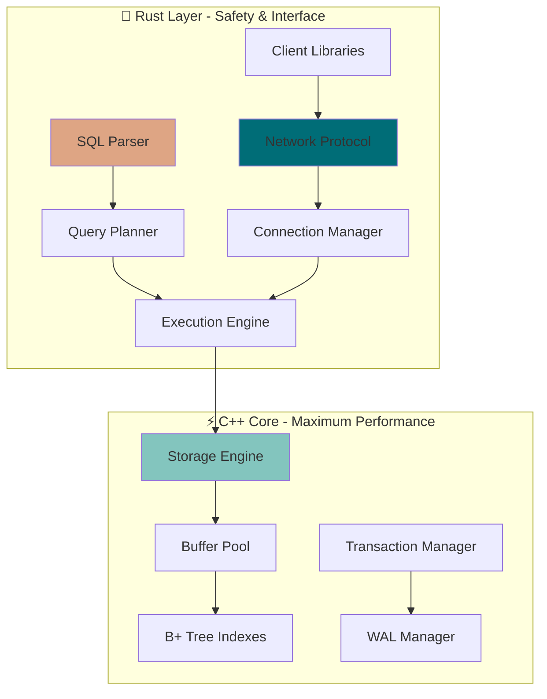

# VeloxDB

### High-Performance Custom Database Engine

<div align="center">

[](https://www.rust-lang.org/)
[](https://isocpp.org/)
[](https://opensource.org/licenses/MIT)
[](https://github.com)

**A blazingly fast, modern database engine built with Rust 🦀 and C++ ⚡**

_Demonstrating advanced systems programming with hybrid language architecture_

</div>

## 🚀 Quick Start

```bash
# 🔥 One-command setup
curl -sSL https://install.veloxdb.dev | bash

# 🏗️ Or build from source
git clone https://github.com/yourusername/veloxdb.git
cd veloxdb && ./scripts/build.sh

# ⚡ Start the server
cargo run --bin velox-server --release
```

## 💡 Usage Example

```rust
use velox_client::VeloxClient;

#[tokio::main]
async fn main() -> Result<(), Box<dyn std::error::Error>> {
    // 🔌 Connect to VeloxDB
    let client = VeloxClient::connect("localhost:5432").await?;

    // 📊 Create table with modern syntax
    client.execute("
        CREATE TABLE analytics (
            id BIGINT PRIMARY KEY,
            event_name VARCHAR(100) NOT NULL,
            user_id BIGINT,
            properties JSONB,
            timestamp TIMESTAMP DEFAULT CURRENT_TIMESTAMP
        )
    ").await?;

    // ⚡ Lightning-fast inserts
    client.execute("
        INSERT INTO analytics (id, event_name, user_id, properties)
        VALUES (1, 'page_view', 12345, '{\"page\": \"/dashboard\"}')
    ").await?;

    // 🔍 Query with blazing speed
    let results = client.query("
        SELECT event_name, COUNT(*) as count
        FROM analytics
        WHERE timestamp >= '2024-01-01'
        GROUP BY event_name
        ORDER BY count DESC
    ").await?;

    println!("📊 Results: {:?}", results);
    Ok(())
}
```

---

## 🏗️ Architecture Overview

<div align="center">



</div>

### 🎨 **Hybrid Design Philosophy**

| Component             | Language | Why?                                       |
| --------------------- | -------- | ------------------------------------------ |
| **🔍 SQL Parser**     | 🦀 Rust  | Memory safety, excellent parsing libraries |
| **⚡ Storage Engine** | ⚙️ C++   | Maximum performance, direct memory control |
| **🌐 Networking**     | 🦀 Rust  | Async I/O, safe concurrency                |
| **📊 Indexing**       | ⚙️ C++   | Cache optimization, SIMD instructions      |

---

## 📁 Project Structure

```
veloxdb/
├── 📋 README.md                 # You are here!
├── 🦀 Cargo.toml               # Rust workspace
├── ⚙️ CMakeLists.txt           # C++ build config
├── 🐳 docker-compose.yml       # Dev environment
├── 📚 docs/                    # Architecture & API docs
├── 🔧 scripts/                 # Build & utility scripts
├── 📦 crates/                  # Rust components
│   ├── 🌐 velox-server/        # Database server
│   ├── 📱 velox-client/        # Client library
│   ├── 🔍 velox-query/         # SQL parser & planner
│   ├── 📡 velox-protocol/      # Network protocol
│   └── 🔗 velox-bindings/      # C++ FFI bindings
├── ⚡ cpp/                     # C++ core engine
│   ├── 📂 include/storage/     # Storage engine headers
│   ├── 🗃️ src/storage/         # Implementation
│   └── 🧪 tests/               # C++ unit tests
├── 🧪 tests/                   # Integration tests
└── 📖 examples/                # Usage examples
```
